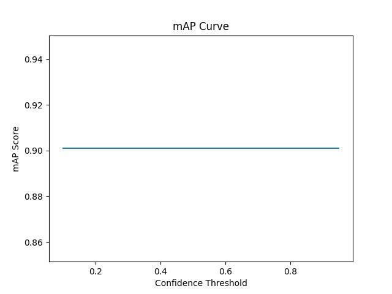

# Model Training (Yolo-nas):

  

  
  

  
  

# Steps :

	1.Data gathering
	
	2.Data Preprocessing
	
	3.Model Training (yolo-nas)
	
	4.Evaluate the Model
	
	5.Run the infrence on video

	
2. In data-preprocessing folder there are two scripts for preprocessed the gathered data.

3. Model training (yolo-nas):

	* run the command : python train.py
	
	Note: You might need to change the path of the dataset as per your need.
	
	* After training the model, trained model file will be stored in checkpoint directory.
	
4. Evaluate the Model:
	
	* Run the command : python evaluate.py
	 
	* After executing this command you'll get the evaluation charts of a model.

5. Run the infrence:

	* run the command : python infrence.py
	
	Note: you might need to change the path of the model and video.
	

	

